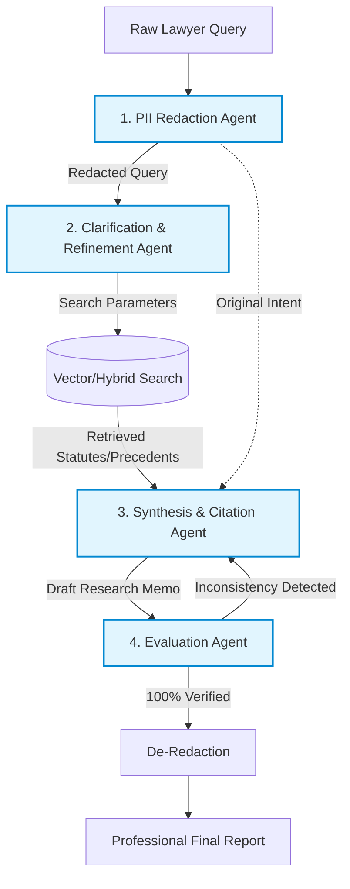

# Agent Architecture Design: RAGBase

## Core Agents Overview

1. **PII Redaction Agent (The Privacy Firewall)**
   - **Trigger:** Immediate upon query receipt.
   - **Action:** Scans and anonymizes PII (names, A-numbers, SSNs).
   - **Purpose:** Prevents sensitive data from hitting core reasoning LLMs. Total compliance (HIPAA, GDPR, attorney-client privilege).

2. **Clarification & Refinement Agent (The Search Architect)**
   - **Trigger:** Receives redacted query.
   - **Action:** Translates complex, multi-layered expert questions into highly optimized search parameters.
   - **Purpose:** Guides hybrid search pipeline to pinpoint exact precedents, clauses, or historical context.

3. **Synthesis & Citation Agent (The Domain Expert)**
   - **Trigger:** Receives retrieved documents and refined query.
   - **Action:** Analyzes documents, constructs logical research memos.
   - **Purpose:** Maps every claim to exact, line-by-line citations from real-time trusted sources. No black-box answers.

4. **Evaluation Agent (The Anti-Hallucination Reviewer)**
   - **Trigger:** Receives draft memo from Synthesis Agent.
   - **Action:** Cross-references synthesized output against original retrieved source texts.
   - **Purpose:** Detects logical leaps or fabrications. Forces rewrite if inconsistent. Guarantees 100% verifiable output.

## System Interaction Flow

