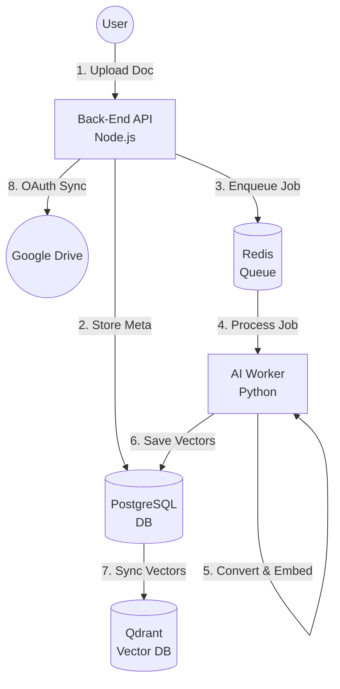
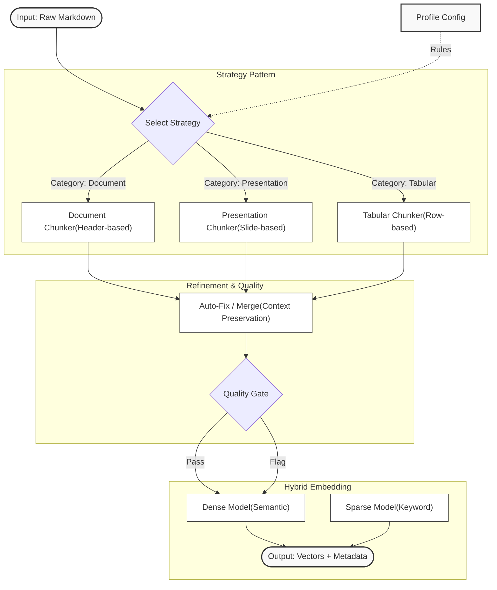
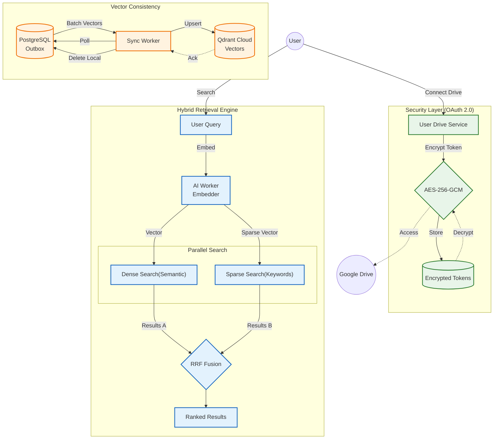
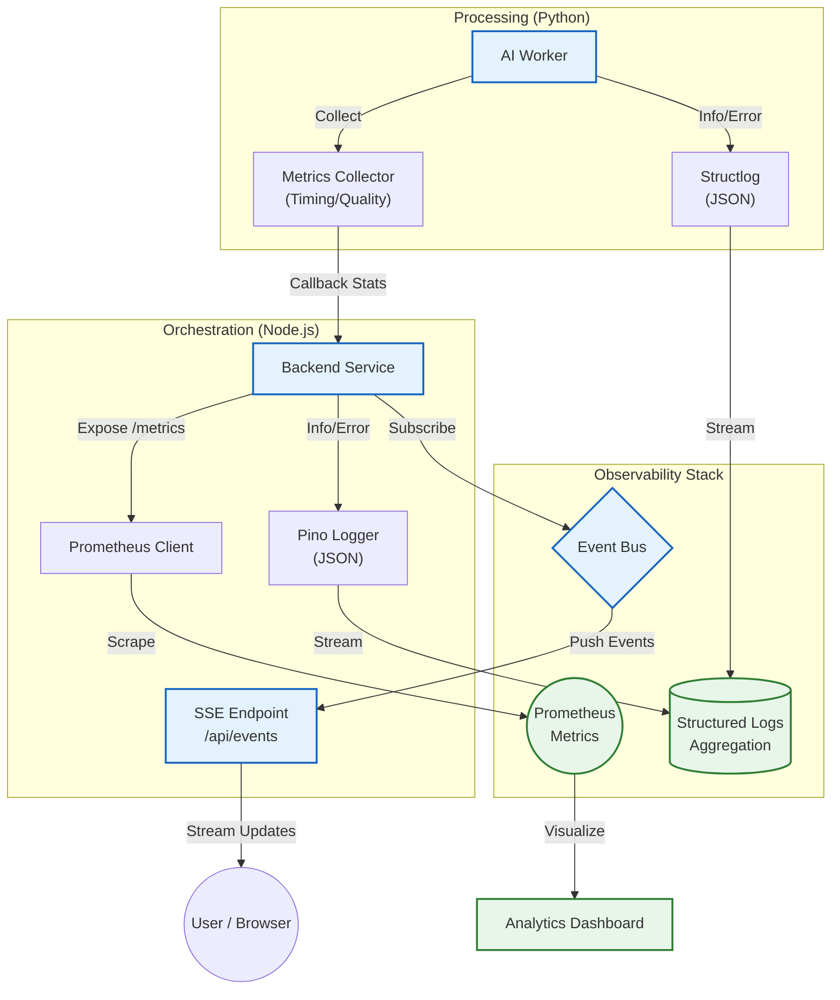

## 1. Executive Summary & Value Proposition

### The Problem: The "Data Context Gap"
* **Zero ROI & Dark Data:** Despite billions in investment, **95% of enterprise AI pilots fail** because models cannot access the unstructured "dark data" locked in complex PDFs and spreadsheets. Source: The GenAI Divide: State of AI in Business 2025 - MIT NANDA
* **Engineering Bottleneck:** Organizations lack the specialized engineering to build robust ingestion pipelines, leaving them with brittle systems. Source: Emerging Architectures for LLM Applications - a16z.
* **The "Build Trap":** Internal attempts to build these systems fail at **double the rate** of unified solutions due to underestimated complexity. Source: The State of Generative AI in the Enterprise - Menlo Ventures

### The Solution: RAGBase
**RAGBase** is an Open Source, self-hosted **ETL (Extract, Transform, Load)** system designed to solve the unstructured data crisis for SMEs.
* **"Set & Forget" Pipeline:** Transforms chaotic file dumps into structured, type-safe vector embeddings without manual intervention.
* **Instant RAG-Readiness:** Instantly creates a queryable Knowledge Base for your AI agents.
* **Data Sovereignty:** A "Bring Your Own Infrastructure" model via Docker that ensures **zero data egress** and eliminates expensive vendor lock-in.

### Building Philosophy
* **Document-driven development** 
* **Test-driven development**
* **Observability-driven development**

## 2. System Architecture & Tech Stack

Showcase your ability to design scalable, decoupled systems using a **three-tier container architecture**.

### High-Level Design

### System Flow
1.  **Upload**: User uploads a document to the Node.js Backend.
2.  **Metadata**: System stores document metadata in PostgreSQL.
3.  **Queue**: Backend adds a processing job to the Redis queue.
4.  **Process**: Python AI Worker picks up the job.
5.  **Transformation**: Document is converted, chunked, and embedded.
6.  **Outbox**: Vectors are saved to the PostgreSQL generic "Outbox".
7.  **Sync**: A separate worker batches vectors from PostgreSQL to Qdrant Cloud.
8.  **Sync**: (Optional) Backend syncs files from Google Drive if configured.

* **Orchestration Layer (Node.js/Fastify):** Manages BullMQ job queues, SSE real-time events, and Google Drive OAuth synchronization.
* **Processing Layer (Python/FastAPI):** A dedicated AI Worker handling conversion (Docling), chunking (LangChain), and hybrid embeddings (FastEmbed).
* **Persistence Layer:**
    * **PostgreSQL:** Stores document metadata and quality metrics.
    * **Qdrant Cloud:** Executes hybrid vector searches (Dense + Sparse).
    * **Redis:** Powers the BullMQ job queue and system caching.

## 3. The Unified Processing Pipeline

Explain your **Strategy Pattern** approach to handling high-variance data.

* **Multi-Format Support:** A single entry point for 10 formats including PDF, DOCX, PPTX, HTML, and Tabular data (XLSX, CSV).
* **Category-Aware Chunking:** Instead of naive splitting, the system applies strategies based on content type: **Header-based** for documents, **Slide-based** for presentations, and **Row-based** for tables.
* **The Quality Gate:** Every chunk passes through an analyzer that flags issues (e.g., `TOO_SHORT`, `FRAGMENT`) and applies **Auto-Fix rules** to ensure high-fidelity retrieval.

## 4. Advanced Retrieval & Security

Detail the production-ready features that make the system resilient and effective.

* **Hybrid Search Engine:** Utilizes **BGE-small-en-v1.5** for semantic (dense) search and **SPLADE** for neural sparse (keyword) search, combined via **Reciprocal Rank Fusion (RRF)**.
* **Vector Outbox Pattern:** To ensure 100% data consistency, vectors are stored in PostgreSQL first and then batch-synced to Qdrant, allowing for **90%+ storage savings** by nullifying local vectors after a successful sync.
* **Enterprise Security:** Per-user Google Drive integration using **OAuth 2.0** with refresh tokens encrypted via **AES-256-GCM**.

## 5. Observability & Professional Standards

Demonstrate that the system is built for the real world.

* **Real-Time Feedback:** Implemented **Server-Sent Events (SSE)** to provide instant UI updates for processing statuses and sync progress.
* **Monitoring:** Integrated **Prometheus** metrics and **Pino/Structlog** for structured JSON logging across both Node.js and Python environments.
* **Analytics Dashboard:** A dedicated interface to monitor pipeline efficiency, average quality scores, and chunk distribution.
