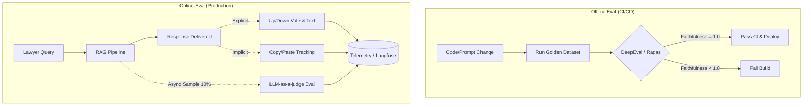

# Eval System Design: RAGBase for Immigration Law

## 1. Core Constraints
- Zero Hallucination. (Malpractice risk).
- Strict Citation required (INA, 8 CFR, USCIS Manuals, BIA Precedents).
- High Context Recall. Missing policy = bad legal advice.

## 2. Evaluation Metrics
- **Faithfulness**: Answer 100% derived from context. Zero tolerance for external LLM knowledge.
- **Answer Relevance**: Directly answers prompt without fluff.
- **Context Precision**: High signal-to-noise ratio in retrieved chunks.
- **Custom Metric (Legal Validity)**: LLM-as-a-judge verifies if citations exactly match source text.

## 3. Golden Dataset (The Benchmark)
- ~500 QA pairs verified by human attorneys.
- Categories:
  - Routine (H-1B caps, L-1, TN, marriage Green Card).
  - Complex (Status adjustments, aging out/CSPA rules, 212(h) waivers).
  - Adversarial (Trick questions, queries based on outdated admin policies).

## 4. Pipeline & Architecture Flow

### A. Offline Eval (CI/CD)
- Triggers on prompt, index, or chunking strategy changes.
- Runs Golden Dataset via Ragas or DeepEval.
- Pass/Fail CI gate. Faithfulness score MUST = 1.0. Block deployment if failed.

### B. Online Eval (Production)
- Asynchronous shadow eval pipeline.
- Samples 10% live queries. Runs optimized LLM-as-a-judge for fallback errors.
- Explicit Feedback: UI has Up/Down vote + quick text feedback for lawyers.
- Implicit Feedback: Track copy/paste events from UI. High copy rate = high quality.

## 5. Tech Stack
- **Metrics Engine**: DeepEval or Ragas (customized criteria).
- **Tracing/Observability**: Langfuse or LangSmith (logs prompt, retrieved chunks, output).
- **Judge LLM**: GPT-4o or Claude 3.5 Sonnet (Requires high reasoning, temperature 0).
