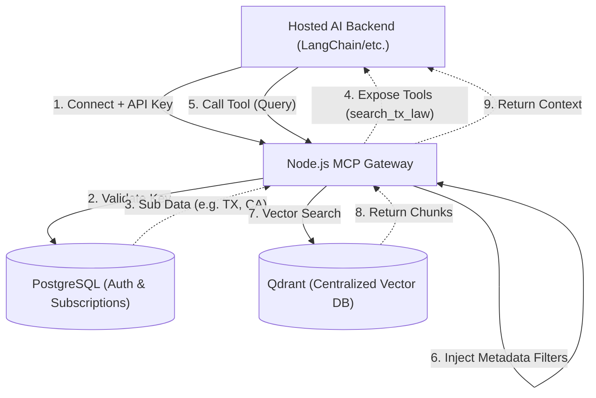

# Centralized MCP Gateway Design

## 1. Core Concept
- **Single Vector Database**: All 5 million+ chunks (Immigration + 50 states Family Laws) in one Qdrant cluster.
- **Single MCP Server**: One centralized Node.js Gateway.
- **Dynamic Tooling**: Exposes specific search tools to LLM (Claude/Cursor) based on client API Key.
- **Strict Data Isolation**: Enforced via Qdrant payload filtering at the gateway level.

## 2. High-Level Architecture



## 3. Data Schema

### Vector Payload (Qdrant)
Crucial indices for fast filtering.
- `domain`: `immigration` | `family_law`
- `state`: `ALL` | `TX` | `CA` | ...
- `doc_id`: UUID
- `text`: string

### Subscription Model (PostgreSQL)
- `tenant_id`: UUID
- `api_key_hash`: string
- `subscriptions`: JSONB -> `{"immigration": true, "family_law": ["TX", "CA"]}`

## 4. Request Flow

### A. Initialization (Dynamic Tool Registration)
1. Hosted AI Backend verifies user access in Postgres.
2. AI Backend reads `subscriptions`.
3. AI Backend spawns MCP Gateway via STDIO, passing the subscriptions.
4. Gateway dynamically constructs tool list.
   - Example A (Texas Only): `list_tools` returns `["search_texas_family_laws"]`
   - Example B (Full Access): `list_tools` returns `["search_immigration_laws", "search_all_family_laws"]`
5. LLM receives clean, narrow tool scopes. Reduces hallucination.

### B. Execution (Metadata Filtering)
1. LLM executes tool: `search_texas_family_laws(query: "child custody divorce")`
2. MCP Gateway captures the raw text query request.
3. **Embedding Step**: Gateway converts the text string `"child custody divorce"` into a dense/sparse vector representation (e.g., calling OpenAI embeddings API, or routing to the internal Python AI Worker).
4. Gateway **hardcodes** the subscription filters to prevent unauthorized access.
```json
{
  "filter": {
    "must": [
      { "key": "domain", "match": { "value": "family_law" } },
      { "key": "state", "match": { "value": "TX" } }
    ]
  }
}
```
5. The combined Vector + Filter payload is sent to Qdrant.
6. Qdrant returns top-K matching document chunks to the MCP Gateway.
7. Gateway formats these chunks as a standard MCP `text` response.
8. The response is returned to the Hosted AI Backend via `stdout`.
9. **Final Synthesis**: The Backend's LLM Agent reads this context, synthesizes the legal information, and sends the final natural language answer to the user's browser.

## 5. Deployment
- **Infra**: AWS ECS or EC2 Docker Compose.
- **Gateway**: Node.js + official `@modelcontextprotocol/sdk`.
- **Clients**: The Hosted AI Backend connects directly to the MCP Gateway as a sub-process via STDIO transport.

## 6. Detailed Implementation Guide

### A. The Node.js MCP Server Setup (STDIO)
Because the AI Agent backend is hosted on the same cloud infrastructure as the RAGBase system, the Gateway leverages **STDIO (Standard Input/Output)** transport. This eliminates the need for network ports, SSE streams, or HTTP timeouts, providing lightning-fast Inter-Process Communication (IPC).

### B. Gateway Initialization & Spawning
When a user begins a chat session, your Hosted AI Backend acts as the MCP Client.
1. The AI Backend verifies the user's permissions in the PostgreSQL database.
2. The AI Backend spawns the Node.js MCP Gateway as a child process, passing the user's validated subscriptions (e.g., via environment variables or initialization arguments).
3. A secure, local STDIO transport session is established.

### C. Dynamic Tool Registration Strategy
Instead of defining a static list of tools for every user, the server dynamically generates the tools based on the user's validated subscriptions.
- If a user only has access to Texas data, the server registers a single tool specifically named for Texas (e.g., `search_family_law_tx`).
- If a user has full access, the server registers tools for all available domains.

When the LLM asks the server what tools are available, it only sees the tools it is authorized to use. Behind the scenes, all tools route to a single core search function, but with hardcoded domain and state metadata filters applied server-side.

### D. The Crucial Security Principle (Zero Hallucination Routing)
By registering tools dynamically:
1. **No LLM Guesswork**: The LLM is never given a generic search tool where it has to "guess" or provide the state code. This prevents the LLM from hallucinating and attempting to access data the user hasn't paid for.
2. **Optimized Context Window**: The LLM only receives tool definitions relevant to the user's subscription, saving tokens and keeping the AI focused.
3. **Impenetrable Data Isolation**: Because the metadata filters (like `state=TX`) are hardcoded into the dynamically generated tool on the server side, the client or LLM cannot manipulate the vector database filter query.

