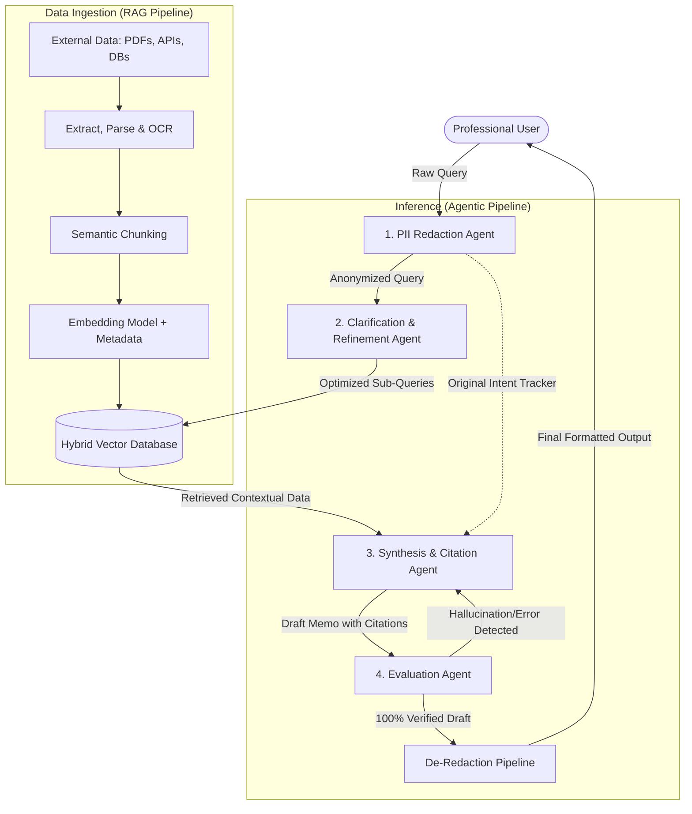

# RAGBase: Enterprise AI Agents for Law, Finance, and Healthcare

**A specialized multi-agent AI platform designed for SMEs. RAGBase automates complex research, ensures strict data privacy (PII filtering), and delivers hallucination-free insights with verifiable citations for legal, financial, and medical professionals.**

---

## 🚀 Unique Selling Propositions (USPs)

### 1. Zero-Compromise Data Privacy
Strict compliance for Legal, Financial, and Medical sectors (HIPAA, GDPR, Attorney-Client Privilege). No sensitive data exposure to reasoning models.
- **Core Feature - Automated PII Firewall:** Scans and redacts Personally Identifiable Information (PII) like names, SSNs, and medical records instantly upon data entry or prompt submission. Core reasoning engine never sees raw sensitive data.

### 2. Verifiable Truth, Zero Hallucination
Guarantees authentic, non-fabricated case law, financial metrics, and medical facts.
- **Core Feature - Self-Evaluating Loop & Exact Citations:** Multi-agent self-correction loop. Evaluation Agent acts as strict reviewer, cross-checking output against source. Forces rewrites on hallucinations/logical gaps. Delivers precise, line-by-line clickable citations. 

### 3. Deep Domain Context Mastery
Understands complex expert intent beyond basic keyword matching. Retrieves crucial precedents, nuanced data, and indirect histories.
- **Core Feature - Agentic Query Refinement & Hybrid Search Pipeline:** Clarification Agent breaks complex questions into optimized sub-queries. Hybrid Search (Vector + Keyword) retrieves precise structured context from complex unstructured data.

---

## 📚 Data Ingestion & RAG Pipeline

Before reasoning begins, RAGBase builds a highly structured knowledge base from unstructured sources:
1. **Multi-Source Ingestion:** Connects to scattered enterprise data (USCIS cases, BIA precedents, SEC filings, HIPAA-compliant patient files).
2. **Intelligent ETL & OCR:** Extracts text from varied formats (PDFs, locked Word docs, scanned images).
3. **Semantic Chunking:** Preserves the structural integrity of long-form clauses and histories, rather than arbitrary character splits.
4. **Enriched Vector Embeddings:** Embeds text alongside critical metadata (dates, document type, jurisdiction) to power precise hybrid filtering.
5. **Continuous Sync:** Automatically monitors and updates the vector database when new laws or client records are added.

---

## 🤖 Core Agent Architecture

### 1. PII Redaction Agent (The Privacy Firewall)
Strict security layer before cognitive processing. Instantly scans and anonymizes PII. Ensures sensitive raw data never reaches core reasoning engine, guaranteeing total compliance.

### 2. Clarification & Refinement Agent (The Search Architect)
Translates complex, multi-layered expert queries. Breaks queries into highly optimized search parameters. Guides Hybrid Search to retrieve exact precedents, clauses, or historical context.

### 3. Synthesis & Citation Agent (The Domain Expert)
Core reasoning engine. Analyzes retrieved documents to build comprehensive, logical research memos. No black-box answers. Maps every claim to exact, line-by-line citations from trusted sources.

### 4. Evaluation Agent (The Anti-Hallucination Reviewer)
Rigorous, independent auditor. Operates self-correcting loop before output delivery. Cross-references synthesized output against original source texts. Detects logical leaps, fabrications, or hallucinations. Forces rewrites to guarantee 100% verifiable professional reports.

---

## 🔄 High-Level System Architecture

